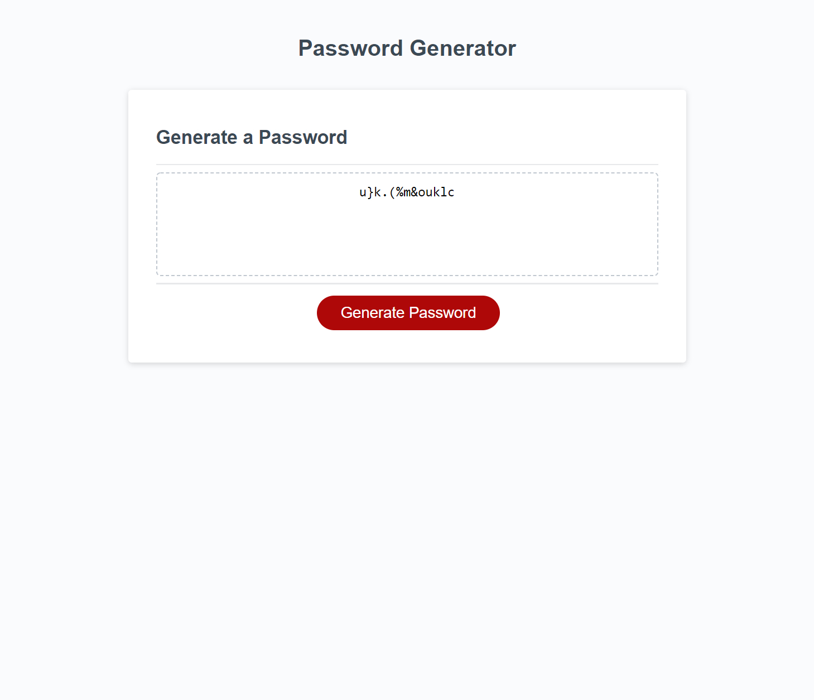

# Password Generator Starter Code

Password Generator is an application that allows user to generate password with the length between 8 to 128 characters while having the option to choose a criteria of having Upper/Lower Case, numbers and special characters. Feel free to play with it!

#### This page is licensed under (click badge for license page): 

## Built With
* JavaScript
* HTML
* CSS

## Table of Contents
* [Installation](#installation)
* [Usage](#usage)
* [Credits](#credits)
* [License](#license) 
* [Contact ](#contact)

## Installation
No installation is required.

## Usage
Screenshot:  
 

## Credits
Created by Ricky Leung

## License
Notice: This license is covered under (https://opensource.org/licenses/MIT)

## Contact 
GitHub: http://github.com/ricky0320  
Email: ricxx0320@gmail.com